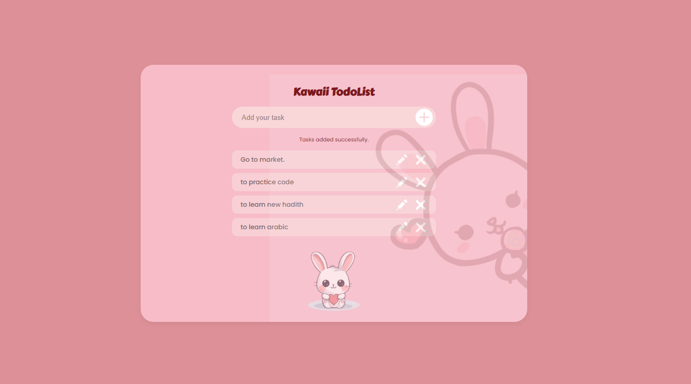

#  Kawaii Todo List 


A responsive **Kawaii Todo List** user interface built using **HTML5** and **CSS3** based on the provided Figma design. The objective of this project was to recreate the design as accurately as possible using only HTML and CSS, without implementing any JavaScript functionality. The project focuses on layout, typography, colors, spacing, rounded corners, and responsive design while maintaining the cute "kawaii" aesthetic.

The interface features a rounded task input, an add button, sample task items with edit and delete icons, a soft pink theme, a faded bunny watermark, and a bunny mascot at the bottom of the card. The layout is responsive and adapts well to different screen sizes using CSS media queries.


## 🔗 Live Demo

**Live Site:** https://hayatabdulfetah.github.io/kawaii-todo-list/

---

## 📸 Screenshot

<p float="left">
  
</p>

---

## 🛠️ Built With

* HTML5
* CSS3
* Flexbox
* CSS Media Queries
* Google Fonts (Fredoka & Poppins)

---

## ✨ Features

* Responsive layout
* Pixel-inspired recreation of the provided Figma design
* Soft kawaii pink color palette
* Rounded cards, inputs, and buttons
* Background bunny watermark
* Cute bunny mascot
* Organized and reusable HTML & CSS

---

## 📂 Project Structure

```text
kawaii-todo-list/
│
├── index.html
├── style.css
├── README.md
│
└── assets/
    ├── add.png
    ├── edit.png
    ├── delete.png
    ├── bunny.png
    ├── background-bunny.jpg
    └── screenshot.png
```

---

## 🚀 My Approach

I started by studying the Figma design carefully and breaking it into smaller sections, including the heading, input area, task list, and decorative images. After creating the HTML structure, I used CSS Flexbox to align the components and applied colors, spacing, border radius, and shadows to closely match the original design. Finally, I added media queries to ensure the interface remained responsive on smaller screens.

---

## 💪 Challenges

The most challenging part of this project was matching the Figma design as closely as possible. Small details such as spacing, sizing, button positioning, and the faded bunny watermark required multiple adjustments before the interface closely resembled the original design. Making the layout responsive while preserving the visual appearance was another challenge that I addressed using CSS media queries and flexible sizing.

---

## 🎯 What Was Easy

Creating the basic HTML structure and organizing the layout was straightforward. Using Flexbox made it easier to align the input field, task items, and icons consistently throughout the design.

---

## 📚 What I Learned

Through this project, I strengthened my HTML and CSS skills by recreating a UI from a Figma design. I gained more experience with Flexbox, responsive design, positioning elements, using background images, and paying close attention to small design details to create a polished user interface.

---

## 👩‍💻 Author

**Hayat**
